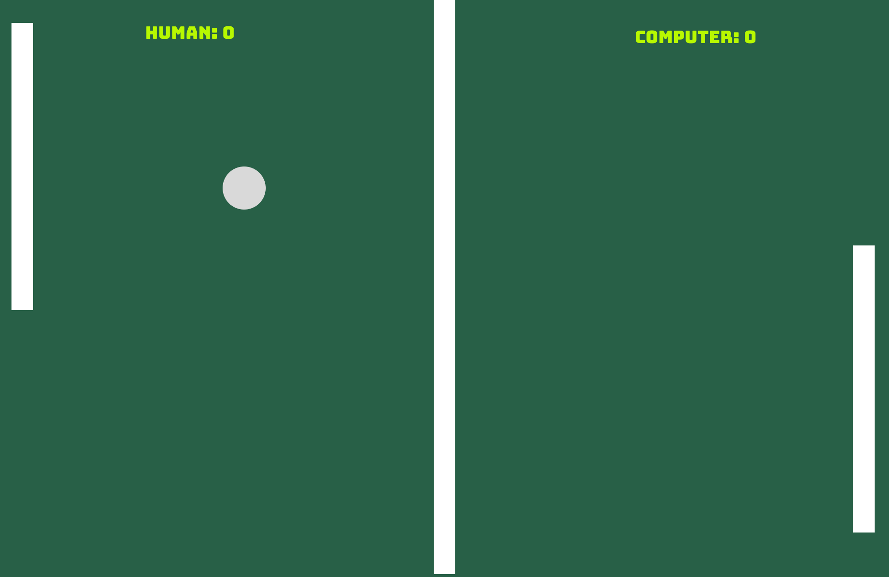

<h1 align="center"> Jogo Ping-Pong com JS </h1>

Jogo básico de ping-pong criado com JS. Onde há dois jogadores: human vs computer.

  <a href="#-tecnologias">Tecnologias</a>&nbsp;&nbsp;&nbsp;|&nbsp;&nbsp;&nbsp;
  <a href="#-projeto">Projeto</a>&nbsp;&nbsp;&nbsp;|&nbsp;&nbsp;&nbsp;
  <a href="#memo-licença">Licença</a>

  

 

  

## 🚀 Tecnologias

Esse projeto foi desenvolvido com as seguintes tecnologias:

- JavaScript
- Git e Github
- Figma

## 💻 Projeto

O projeto "Jogo de ping-pong feito com JS", por mais básico que seja, ajuda no desenvolvimento da lógica e no aprendizado a linguaguem JavaScript.

##  📄 Licença

Esse projeto está sob a licença MIT.

